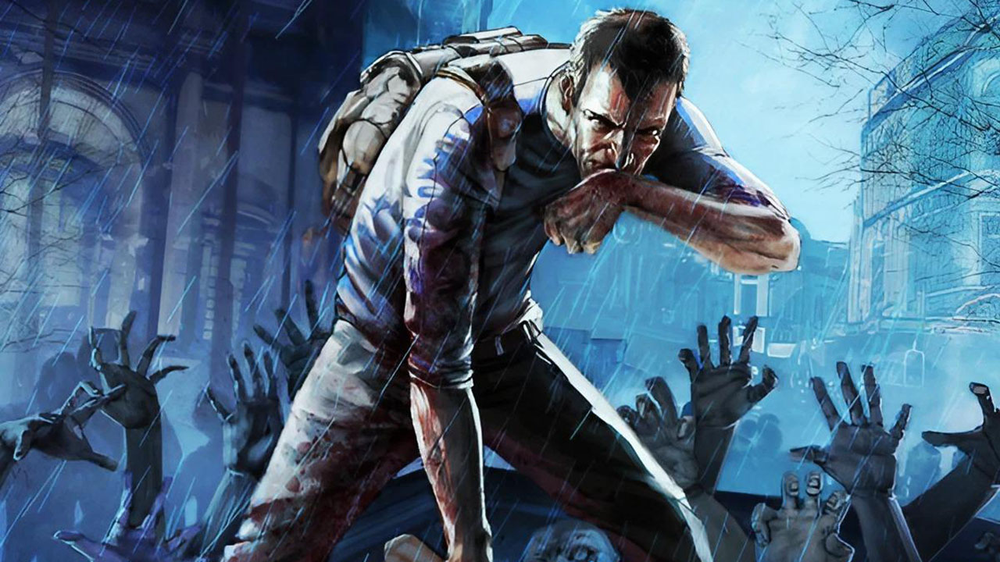
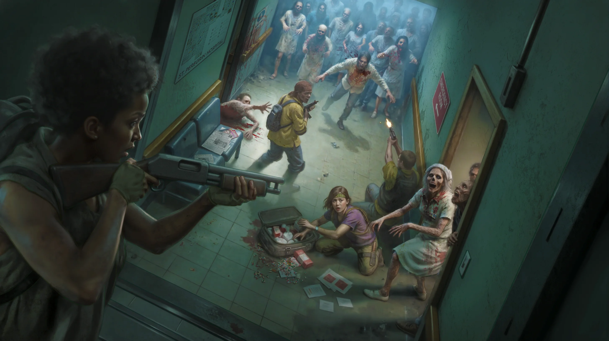

<p align="center">
  
</p>

# PJZBD

> **A community-powered, AI-assisted reimagining of Project Zomboid Build 42.**
> Free to play with, non-commercial, and built in the open.

PJZBD is a personal modding archive that aims to **rework Project Zomboid
using mostly free community content** — the project layers original mods,
curated workshop references, and a careful set of authoritative B42 sources
into a single workspace where the apocalypse can be reshaped.

Most of the source here is **AI-assisted, written for time-sake, and
released for free**. No monetization, no Patreon, no ads — just an open
sandbox for ideas and the people who want to play with them.

---

## ✨ What this project is

- A **mod archive** — Workshop-ready Project Zomboid Build 42 mods, kept
  in a clean, deployable layout.
- A **community-content rework** — built on, and alongside, the work of
  Workshop creators, with their mods used as references and inspiration
  in the dev workspace.
- An **AI collaboration sandbox** — Claude Code drives the research,
  planning, and most of the implementation, against a curated B42 reference
  set so the output stays grounded in real game source.
- **Non-profit, community-first** — every mod here is intended to ship
  free on the Steam Workshop. Time and attention are the only currencies.

---

## 🧠 How it's built

```
Research  →  Plan  →  Build  →  Deploy  →  Play-test  →  Verify  →  Ship
```

Each slice of work goes through the same loop:

1. **Research** against the curated B42 reference set and the vanilla
   game's own Lua — no guesswork, no AI prior knowledge taken on faith.
2. **Plan** the slice into small, verifiable tasks.
3. **Build** in the dev workspace (`modPlanner/<ModName>/`).
4. **Deploy** by copying into `Mods/<ModName>/` and then into the live
   `Zomboid/mods/` folder.
5. **Play-test** in-game until the slice behaves end-to-end.
6. **Verify** against the slice's success criteria.
7. **Ship** when (and only when) it actually works.

The AI does the heavy typing; the human does the play-testing and the
"does this actually feel good?" judgement calls.

---

## 🗺️ Repository Layout

```
PJZBD/
├── Mods/             Deploy-ready, Workshop-shaped mod copies
├── modPlanner/       Active dev workspace (gitignored)
│   ├── <ModName>/    One folder per mod under iteration
│   ├── reference/    Curated B42 modding reference
│   ├── workshop refs/  Workshop mods kept locally for inspiration & study
│   └── ProjectZomboid/  Read-only local game install (ground truth)
├── docs/images/      Artwork and screenshots used by this README
├── README.md
└── .gitignore
```

Each mod under `Mods/` follows the standard PZ layout:

```
Mods/<ModName>/
├── mod.info
├── 42/
│   └── media/
│       ├── lua/{client,server,shared}/
│       └── scripts/
└── poster.png
```

---

<p align="center">
  
</p>

## 🎮 Original Mods

### Sanity_traits

A singleplayer Build 42 mod that adds an **occupation-flavored psyche
system**. Survivors carry a hidden sanity meter (0–1000) that drifts
through five stages — **Stable → Shaken → Hollow → Numb → Broken** —
each with thematic flavor and permanent trait consequences. Veterans
start near Numb. Civilians start Stable. Everyone gets there eventually.

A custom **"Psyche" tab** in the character info window surfaces the
meter, current stage, a 50-entry event log, and active sanity-applied
debuff traits — so the player can actually see their character coming
apart.

| Field | Value |
|------|------|
| Compatibility | Build 42 only |
| Scope | Singleplayer |
| Persistence | Per-character ModData |
| License | Free, non-commercial |

<details>
<summary><strong>Roadmap</strong></summary>

| Stage | Scope | Status |
|------|------|--------|
| 1 | Sanity meter, kill-driven decay, profession-based starts | ✅ Complete |
| 2 | "Psyche" tab UI — bar, stage label, event log, debuff row | ✅ Complete |
| 3 | Stage transitions — automatic trait application at thresholds | 📋 Planned |
| 4 | Passive decay + contentment-gated recovery | 📋 Planned |
| 5 | Per-occupation psyche profiles | 📋 Planned |
| 6 | Habit & addiction layer (alcohol / coping) | 📋 Planned |
| 7 | Sandbox menu — every weight & threshold exposed in-game | 📋 Planned |

</details>

---

## 🔧 Workshop References

This workspace keeps a local-only stash of community Workshop mods under
`modPlanner/workshop refs/`. They're **not** redistributed by this repo
(the folder is gitignored) — they live alongside the dev workspace as
study material: how other modders solve UI, persistence, balance, and
event handling in B42.

Every original mod here that draws meaningfully on Workshop content will
list its sources and credit the authors below.

<details>
<summary><strong>Workshop mods studied / referenced</strong> (click to expand)</summary>

> _No items added yet — this section will populate as Workshop mods are
> brought into the `workshop refs/` folder for study._
>
> Format used per entry:
>
> - **Mod Name** — by [Author] · [Workshop link] · _what this project
>   learned or borrowed (with credit)_

</details>

---

## 🌱 Planned Future Mods

These are exploratory — not on a release schedule, but on the radar:

- **Civilian occupation rebalance** — realistic everyday professions,
  stronger starting kits, less binary "combat vs noncombat" framing.
- **Negative-trait expansion** — deeper behavioral consequences,
  extending the ideas first explored in Sanity_traits.
- **Quality-of-life UI** — more "previously hidden" character state
  surfaced in the existing UI, in the same spirit as the Psyche tab.
- **Community-content rework packs** — curated bundles that combine
  free Workshop mods with thin compatibility / balance glue, so a fresh
  install can feel meaningfully different out of the box.

---

## 🤝 Built on community work

PJZBD couldn't exist without:

- **The Indie Stone**, for Project Zomboid itself and for shipping a
  modding surface that's worth digging into.
- **The Workshop modding community**, whose published mods are studied
  and credited per-mod in the Workshop References section above.
- **Open AI tooling**, which makes it possible for one person to ship
  systems that would otherwise take a team.

If your work is referenced here and you'd like the credit adjusted,
removed, or a link added, just open an issue.

---

## 📜 License & ethos

- All original code under `Mods/` is released **free and non-commercial**.
  Per-mod `LICENSE` or `mod.info` fields take precedence where they exist.
- Workshop content stored locally under `modPlanner/workshop refs/` is
  **not** redistributed by this repo and remains the property of its
  original authors.
- Reference material under `modPlanner/reference/` is for personal use
  and is gitignored.
- Artwork in `docs/images/` is Project Zomboid promotional / concept
  art © The Indie Stone, used here illustratively for a non-commercial
  fan project. Happy to remove on request.

---

<p align="center">
  
</p>

<p align="center">
  <em>Made with ❤️, AI, and a lot of zombies.</em>
</p>
